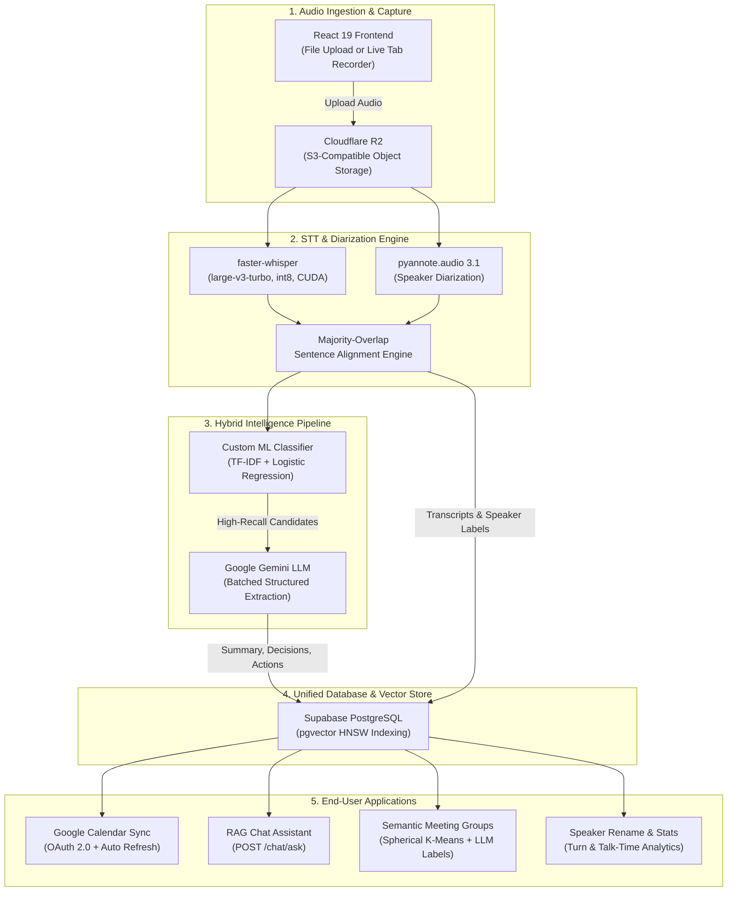

# AI-Powered Meeting & Lecture Intelligence Platform

An end-to-end intelligence platform that transcribes, structures, clusters, and analyzes recorded meetings and academic lectures. The system combines local GPU speech-to-text (`faster-whisper`), pretrained neural speaker diarization (`pyannote.audio`), a domain-adapted hybrid ML sentence classifier, Google Gemini structured extraction, pgvector semantic search (RAG), and 1-click Google Calendar scheduling.

---

## Key Features

- **High-Fidelity Local Speech-to-Text:** Powered by `faster-whisper` (`large-v3-turbo`, `int8` quantization on CUDA with CPU fallback) and Silero VAD for low-latency, zero-API-cost audio transcription.
- **Neural Speaker Diarization & Analytics:** Powered by `pyannote/speaker-diarization-3.1` running at ~19x real-time on CUDA (~1.6GB peak VRAM). Features majority-overlap sentence alignment, speaker talk-time duration and percentage metrics, turn counts, sample quotes, and customizable user-edited display names.
- **Hybrid ML Candidate Pre-Filter:** A custom TF-IDF + Logistic Regression model trained on meeting discourse and procedural motions (83.1% overall accuracy, Decision F1: 0.88, Macro F1: 0.72) that filters conversation noise before LLM refinement.
- **Structured Executive Intelligence:** Batched Google Gemini extraction generating:
  - 5 key takeaways and a cohesive executive summary.
  - Formally resolved decisions (with context and decision-maker).
  - Prioritized action items (with owner, priority, and detected deadline).
  - Descriptive meeting tags.
- **RAG Meeting Chat & Semantic Memory:** 768-dimensional embeddings (`gemini-embedding-001`) indexed with PostgreSQL `pgvector` HNSW indexes in Supabase. Supports natural language cross-meeting Q&A (`POST /chat/ask`) with strict citation grounding and refusal on ungrounded queries.
- **Unsupervised Semantic Meeting Clustering:** Spherical K-Means clustering with automated cosine silhouette score optimization and Gemini-generated 2–4 word category labels, rendered in an interactive "Meeting Groups" accordion UI.
- **Google Calendar OAuth 2.0 Integration:** 1-click scheduling of action items directly to users' primary Google Calendars, featuring server-side token storage in Supabase protected by Row Level Security (RLS) and automated token refresh.
- **In-Browser Tab Audio Recording:** Direct live capture of meeting audio via the browser MediaRecorder API without requiring meeting bots or recording permissions.
- **Cloud Object Storage:** S3-compatible audio persistence via Cloudflare R2 with presigned streaming playback URLs.

---

## System Architecture



---

## Repository Structure

```
├── backend/
│   ├── app/
│   │   ├── api/                  # FastAPI REST endpoints
│   │   │   ├── calendar.py       # Google Calendar OAuth & event scheduling
│   │   │   ├── chat.py           # Grounded RAG conversational Q&A
│   │   │   ├── meetings.py       # Meeting upload, intelligence, speakers & clustering
│   │   │   └── search.py         # Semantic pgvector similarity search
│   │   ├── core/                 # Pydantic configuration & settings
│   │   ├── data/                 # Training dataset (labeled_sentences.csv) & local fallbacks
│   │   ├── ml/                   # Classifier training & evaluation scripts
│   │   ├── models/               # Pydantic request/response schemas
│   │   └── services/             # Core backend business logic
│   │       ├── calendar_service.py # Google Calendar API v3 client & token refresh
│   │       ├── clustering.py     # Spherical K-Means & silhouette score optimization
│   │       ├── diarization.py    # Pyannote pipeline loader & sentence alignment
│   │       ├── embeddings.py     # Gemini embedding generation & indexing
│   │       ├── intelligence.py   # Gemini structured intelligence extraction
│   │       ├── storage.py        # Cloudflare R2 boto3 integration
│   │       ├── supabase_client.py# Supabase database client
│   │       └── transcription.py  # Faster-whisper transcription task
│   ├── main.py                   # FastAPI application entrypoint & middleware
│   ├── requirements.txt          # Python dependencies
│   ├── scripts/                  # Management & backfill utility scripts
│   │   ├── backfill_diarization.py # Retroactive diarization on existing recordings
│   │   ├── check_action_item_recall.py # Spot-check recall validation
│   │   └── cluster_meetings.py   # CLI meeting clustering runner
│   └── supabase/
│       └── migrations/           # PostgreSQL DDL & schema migrations
├── frontend/
│   ├── src/
│   │   ├── components/           # UI components (TranscriptViewer, SpeakerRenameModal, etc.)
│   │   ├── pages/                # Page views (MeetingsListPage, MeetingDetailPage, UploadPage)
│   │   ├── services/             # Frontend HTTP client & API service
│   │   ├── types/                # TypeScript type definitions
│   │   ├── App.tsx               # Root application component & routing
│   │   └── index.css             # Tailwind CSS styling
│   ├── package.json              # Frontend npm dependencies
│   └── vite.config.ts            # Vite configuration
├── DECISIONS.md                  # Architecture Decision Records (ADR-001 to ADR-009)
├── PROJECT_LOG.md                # Detailed chronological changelog & experimental findings
├── .gitignore                    # Git ignore rules
└── README.md                     # Project documentation
```

---

## ML Sentence Classifier Performance

The local sentence classifier acts as a high-recall candidate pre-filter to reduce noise before passing excerpts to Gemini:

- **Architecture:** TF-IDF (unigrams + bigrams, sublinear term frequency scaling) + Logistic Regression (`C=8.0`, `class_weight='balanced'`).
- **Target Classes:** `['Action Item', 'Decision', 'Discussion']`.
- **Validation Metrics (Held-Out Test Set):**
  - **Decision:** Precision = **0.9167**, Recall = **0.8462**, F1 = **0.8800**
  - **Discussion:** Precision = **0.8444**, Recall = **0.9048**, F1 = **0.8736**
  - **Action Item:** Precision = **0.6667**, Recall = **0.3333**, F1 = **0.4444**
  - **Overall Accuracy:** **83.10%** | **Macro-F1:** **0.7194**
- **Domain Adaptation:** Procedural municipal council motions (*"Be it resolved that..."*, mover/seconder confirmations) were explicitly incorporated into the training distribution, closing early procedural blind spots and yielding $>92\%$ confidence on formal votes and approvals.

---

## Speaker Diarization Specifications

- **Model:** `pyannote/speaker-diarization-3.1` (requires accepting user license on Hugging Face).
- **Inference Runtime:** NVIDIA CUDA acceleration (tested on NVIDIA GeForce RTX 3050 Laptop GPU, 6GB VRAM).
- **Processing Speed:** **19.1x faster than real-time** (a ~35-minute meeting processes in ~108 seconds).
- **Memory Footprint:** Peak VRAM allocated is ~1.6 GB, coexisting safely with faster-whisper without out-of-memory risks.
- **Alignment Strategy:** Aligns sentence boundaries to speaker turns via majority duration overlap, with distance-based nearest-neighbor fallback for silence intervals.
- **Architectural Guardrail:** Diarization labels and custom user-edited names serve as visual navigation and transcript search aids; they are deliberately **not** used to automatically assign action items or decisions to individuals without explicit user confirmation.

---

## Getting Started

### Prerequisites

- **Python:** Version 3.10 or 3.11.
- **Node.js:** Version 18+ (with `npm`).
- **FFmpeg:** Installed and added to system `PATH` (required for audio conversion).
- **NVIDIA GPU & CUDA:** (Optional, recommended for fast transcription and diarization).
- **External Accounts / Keys:**
  - [Supabase](https://supabase.com) (PostgreSQL database with `pgvector`).
  - [Google AI Studio](https://aistudio.google.com) (Gemini API key).
  - [Cloudflare R2](https://developers.cloudflare.com/r2/) (S3 credentials & bucket).
  - [Google Cloud Console](https://console.cloud.google.com) (OAuth 2.0 Client ID for Calendar).
  - [Hugging Face](https://huggingface.co) (Access token with permission for `pyannote/speaker-diarization-3.1`).

---

### 1. Database Setup (Supabase)

Execute the SQL migration scripts in order inside the **Supabase SQL Editor**:

1. `backend/supabase/migrations/20260905000000_init_schema.sql` (Tables: `meetings`, `transcripts`, `summaries`, `decisions`, `action_items`, `meeting_tags`, `embeddings`).
2. `backend/supabase/migrations/20260909000000_calendar_tokens.sql` (`calendar_tokens` table with RLS).
3. `backend/supabase/migrations/20260909120000_action_items_google_event_id.sql` (`google_event_id` tracking).
4. `backend/supabase/migrations/20260912000000_chat_messages.sql` (`chat_messages` table).
5. `backend/supabase/migrations/20260912010000_meeting_clusters.sql` (`cluster_id` and `cluster_label` columns).
6. `backend/supabase/migrations/20260913000000_transcripts_speaker_label.sql` (`speaker_label` column).
7. `backend/supabase/migrations/20260913010000_meeting_speaker_names.sql` (`speaker_names` JSONB column).

---

### 2. Backend Setup

```bash
cd backend

# Create and activate virtual environment
python -m venv venv
# On Windows:
venv\Scripts\activate
# On Linux/macOS:
source venv/bin/activate

# Install dependencies
pip install -r requirements.txt

# Create environment file from template
cp .env.example .env
```

Populate `backend/.env` with your actual credentials:

```ini
# Server configuration
HOST=0.0.0.0
PORT=8000
ENVIRONMENT=development
CORS_ORIGINS=http://localhost:5173,http://localhost:3000,http://127.0.0.1:5173

# Supabase
SUPABASE_URL=https://<your-project-ref>.supabase.co
SUPABASE_ANON_KEY=<your-anon-key>
SUPABASE_SERVICE_ROLE_KEY=<your-service-role-key>

# Google Gemini API
GEMINI_API_KEY=<your-gemini-api-key>

# Cloudflare R2
R2_ACCOUNT_ID=<your-account-id>
R2_ACCESS_KEY_ID=<your-access-key-id>
R2_SECRET_ACCESS_KEY=<your-secret-access-key>
R2_BUCKET_NAME=<your-bucket-name>
R2_ENDPOINT_URL=https://<your-account-id>.r2.cloudflarestorage.com

# Faster-Whisper
WHISPER_MODEL_SIZE=large-v3-turbo
WHISPER_DEVICE=cuda
WHISPER_COMPUTE_TYPE=int8

# Google Calendar OAuth 2.0
GOOGLE_CALENDAR_CLIENT_ID=<your-client-id>.apps.googleusercontent.com
GOOGLE_CALENDAR_CLIENT_SECRET=<your-client-secret>
GOOGLE_CALENDAR_REDIRECT_URI=http://localhost:8000/calendar/callback
GOOGLE_CALENDAR_SCOPE=https://www.googleapis.com/auth/calendar.events
FRONTEND_URL=http://localhost:5173

# Hugging Face Token (for pyannote diarization)
HUGGINGFACE_TOKEN=hf_<your-token>
```

Authenticate Hugging Face on your machine (required for pyannote weights):
```bash
hf auth login --token <your-huggingface-token>
```

Start the FastAPI application:
```bash
uvicorn main:app --host 0.0.0.0 --port 8000 --reload
```

- API Health Check: [http://localhost:8000/health](http://localhost:8000/health)
- Interactive API Documentation (Swagger): [http://localhost:8000/docs](http://localhost:8000/docs)

---

### 3. Frontend Setup

```bash
cd frontend

# Install npm packages
npm install

# Create environment file from template
cp .env.example .env
```

Ensure `frontend/.env` contains:
```ini
VITE_API_URL=http://localhost:8000
VITE_SUPABASE_URL=https://<your-project-ref>.supabase.co
VITE_SUPABASE_ANON_KEY=<your-anon-key>
```

Launch the development server:
```bash
npm run dev
```

Open your browser to: [http://localhost:5173](http://localhost:5173).

---

## Primary API Endpoints

| Method | Endpoint | Description |
| :--- | :--- | :--- |
| `POST` | `/meetings/upload` | Uploads audio container to Cloudflare R2 and enqueues transcription & diarization. |
| `GET` | `/meetings/{id}/status` | Client short-polling endpoint returning status, duration, and segment counts. |
| `GET` | `/meetings/{id}/intelligence` | Retrieves executive summary, decisions, action items, and topic tags. |
| `GET` | `/meetings/{id}/transcripts` | Returns timestamped transcript sentences with classifier labels and speaker attribution. |
| `GET` | `/meetings/{id}/speakers` | Aggregates speaker turn counts, total talk time, percentages, and sample quotes. |
| `PATCH` | `/meetings/{id}/speakers` | Updates custom display names for detected speaker tokens. |
| `POST` | `/meetings/cluster` | Re-clusters meetings via spherical K-Means and generates Gemini topic labels. |
| `GET` | `/meetings/clusters` | Retrieves all meetings grouped by cluster for UI accordion display. |
| `POST` | `/chat/ask` | Natural language conversational Q&A grounded in meeting transcripts via pgvector RAG. |
| `GET` | `/calendar/authorize` | Initiates Google OAuth 2.0 flow for calendar synchronization. |
| `POST` | `/meetings/{id}/action-items/{action_id}/add-to-calendar` | Schedules an extracted action item directly on Google Calendar. |
| `GET` | `/search` | Cross-meeting semantic similarity search via pgvector embeddings. |
